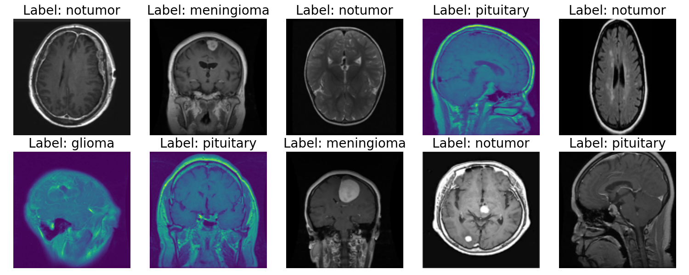
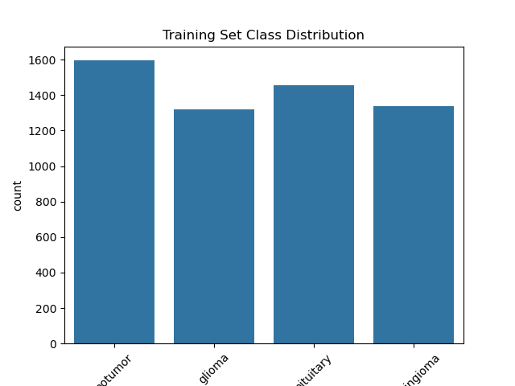
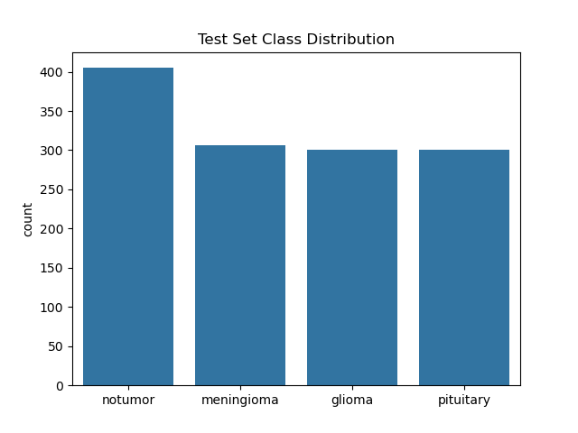
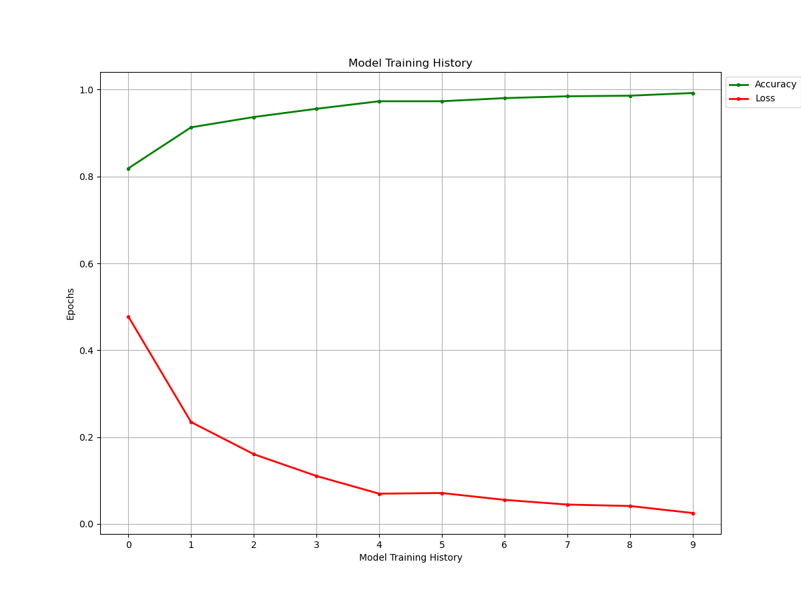
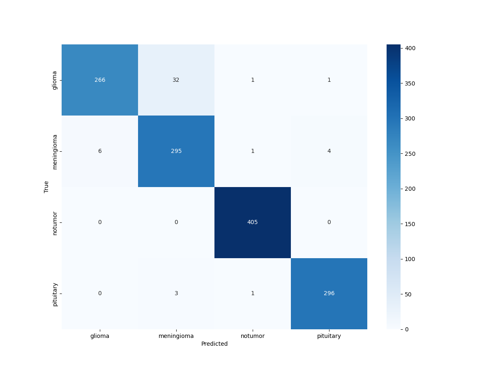
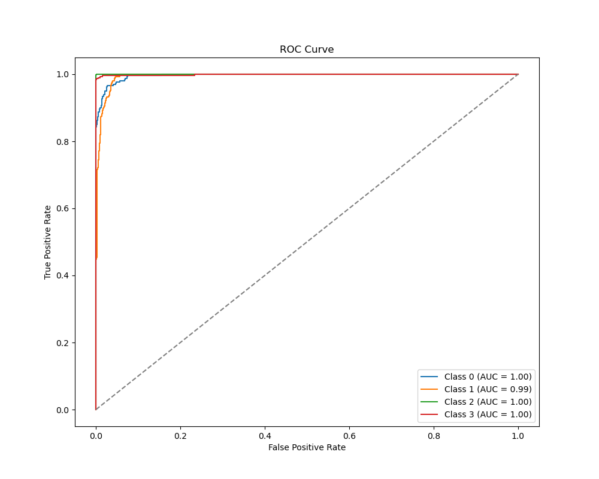
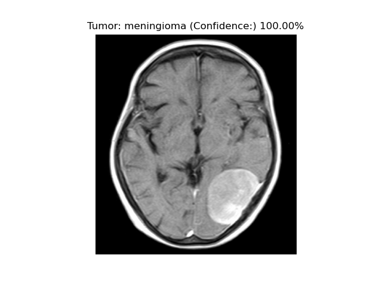
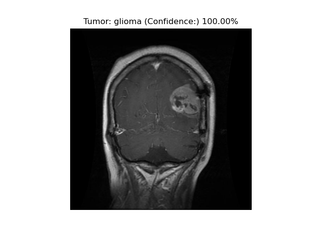
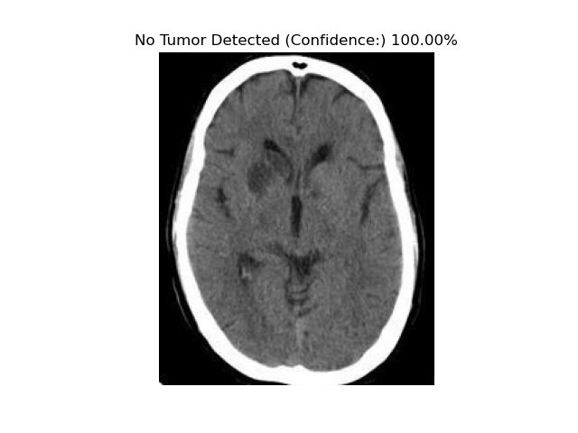
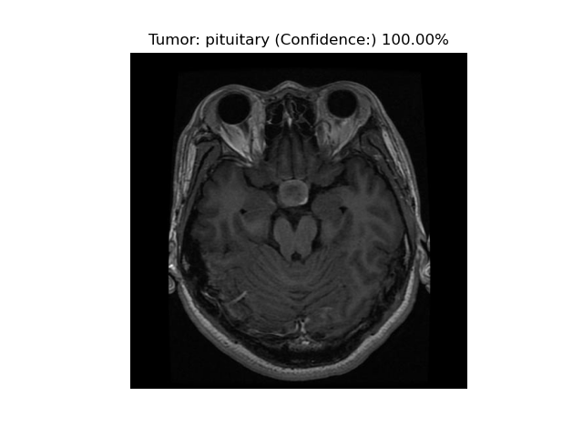

# 🧠 Brain Tumor Detection Using Deep Learning with VGG16

[](https://www.python.org/)
[](https://www.tensorflow.org/)
[](LICENSE)
[](https://github.com/Epicmanpreet01/brainTumorPrediction)

> 🔬 A deep learning-based medical image classification system for automatic **brain tumor detection** from MRI scans using **transfer learning** with the **VGG16** architecture.

---

## 📋 Table of Contents

- [🎯 Overview](#-overview)
- [📊 Dataset](#-dataset)
- [🛠️ Technologies & Libraries](#️-technologies--libraries)
- [✨ Key Features](#-key-features)
- [🏗️ Model Architecture](#️-model-architecture)
- [📈 Performance Metrics](#-performance-metrics)
- [🧪 Prediction Examples](#-prediction-examples)
- [🚀 Quick Start](#-quick-start)
- [📊 Results](#-results)
- [🔮 Future Enhancements](#-future-enhancements)
- [📚 References](#-references)
- [📄 License](#-license)

---

## 🎯 Overview

This project implements a convolutional neural network (CNN) for classifying brain MRI images into four categories: **glioma**, **meningioma**, **pituitary tumor**, and **no tumor**. The model leverages transfer learning with VGG16 to achieve high accuracy in medical image classification.

### 🎯 Objectives

- Develop an automated brain tumor detection system
- Classify MRI images into 4 distinct categories
- Achieve high accuracy using transfer learning
- Provide interpretable predictions with confidence scores

---

## 📊 Dataset

The dataset consists of labeled brain MRI images organized into training and testing sets:

### 📥 Dataset Download

**Download the complete dataset from Google Drive:**

📁 [**Brain Tumor MRI Dataset**](https://drive.google.com/file/d/1pSt9WQ-bM8glc6dcxh6LR33454DjHhql/view?usp=sharing)

> 💡 **Note**: Download and extract the dataset to your project directory before running the model.

### 📁 Dataset Structure

```
📁 Dataset Structure
├── 📂 Training/
│   ├── 📂 glioma/          # Glioma tumor images
│   ├── 📂 meningioma/      # Meningioma tumor images
│   ├── 📂 pituitary/       # Pituitary tumor images
│   └── 📂 notumor/         # Healthy brain images
└── 📂 Testing/
    ├── 📂 glioma/
    ├── 📂 meningioma/
    ├── 📂 pituitary/
    └── 📂 notumor/
```

### 📊 Data Visualizations

#### Random Sample Images


_Figure 1: Random sample of MRI images from the dataset_

#### Class Distribution Analysis

|                 **Training Set**                 |                **Testing Set**                 |
| :----------------------------------------------: | :--------------------------------------------: |
|  |  |
|      _Figure 2: Training data distribution_      |     _Figure 3: Testing data distribution_      |

---

## 🛠️ Technologies & Libraries

### Core Dependencies

|        **Category**        |      **Libraries**      |           **Purpose**            |
| :------------------------: | :---------------------: | :------------------------------: |
|    🧠 **Deep Learning**    |  `TensorFlow`, `Keras`  |   Model building and training    |
|  🖼️ **Image Processing**   |     `Pillow (PIL)`      | Image loading and preprocessing  |
|    📊 **Visualization**    | `Matplotlib`, `Seaborn` |   Data visualization and plots   |
| 🔢 **Numerical Computing** |         `NumPy`         | Array operations and mathematics |
|  📈 **Model Evaluation**   |     `Scikit-learn`      | Metrics and performance analysis |

### Installation

```bash
pip install -r requirements.txt
```

---

## ✨ Key Features

- 🔄 **Transfer Learning**: Leverages pre-trained VGG16 for feature extraction
- 🎯 **Multi-class Classification**: Distinguishes between 4 tumor types
- 📊 **Comprehensive Evaluation**: Confusion matrix, ROC-AUC, classification reports
- 🖼️ **Visual Predictions**: Displays predictions with confidence scores
- 📈 **Training Monitoring**: Real-time accuracy and loss tracking
- 🔍 **Data Preprocessing**: Automated image normalization and augmentation

---

## 🏗️ Model Architecture

```
🧠 VGG16-based Brain Tumor Classifier
┌─────────────────────────────────────┐
│  📥 Input Layer (224×224×3)         │
├─────────────────────────────────────┤
│  🔒 Pre-trained VGG16 Base          │
│     (frozen weights)                │
├─────────────────────────────────────┤
│  🔄 Flatten Layer                   │
├─────────────────────────────────────┤
│  🧠 Dense Layer (256 units, ReLU)   │
├─────────────────────────────────────┤
│  🛡️ Dropout Layer (0.5)             │
├─────────────────────────────────────┤
│  📤 Output Layer (4 units, Softmax) │
└─────────────────────────────────────┘
```

### 🔧 Training Configuration

- **Optimizer**: Adam (`learning_rate=0.0001`)
- **Loss Function**: Categorical Crossentropy
- **Metrics**: Accuracy
- **Batch Size**: 20
- **Epochs**: 10

---

## 📈 Performance Metrics

### 📊 Training History


_Figure 4: Model training progress showing accuracy and loss over epochs_

### 🔍 Detailed Analysis

|               **Confusion Matrix**               |           **ROC-AUC Curves**           |
| :----------------------------------------------: | :------------------------------------: |
|  |  |
|   _Figure 5: Performance across tumor classes_   |  _Figure 6: Multi-class ROC analysis_  |

---

## 🧪 Prediction Examples

The model demonstrates strong performance across all tumor types:

### 🧠 Meningioma Detection

```python
img_path = './Testing/meningioma/Te-me_0017.jpg'
detect_and_display(img_path, model)
```

 <br>
_Figure 7: Meningioma classification result_

### 🧠 Glioma Detection

```python
img_path = './Training/glioma/Tr-gl_0021.jpg'
detect_and_display(img_path, model)
```

 <br>
_Figure 8: Glioma classification result_

### 🧠 Healthy Brain Detection

```python
img_path = './Testing/notumor/Te-no_0010.jpg'
detect_and_display(img_path, model)
```

 <br>
_Figure 9: Healthy brain classification result_

### 🧠 Pituitary Tumor Detection

```python
img_path = './Testing/pituitary/Te-piTr_0009.jpg'
detect_and_display(img_path, model)
```

 <br>
_Figure 10: Pituitary tumor classification result_

---

## 🚀 Quick Start

### 1️⃣ Clone the Repository

```bash
git clone https://github.com/Epicmanpreet01/brainTumorPrediction.git
cd brainTumorPrediction
```

### 2️⃣ Install Dependencies

```bash
pip install -r requirements.txt
```

### 3️⃣ Download Dataset

1. Download the dataset from the [Google Drive link](https://drive.google.com/file/d/1pSt9WQ-bM8glc6dcxh6LR33454DjHhql/view?usp=sharing)
2. Extract the downloaded file to your project directory
3. Ensure the dataset follows the structure shown in the [Dataset](#-dataset) section

### 4️⃣ Run the Model

```bash
# Using Jupyter Notebook
jupyter notebook model.ipynb

# Or using Python directly
python train_model.py
```

### 5️⃣ Make Predictions

```python
from model import detect_and_display

# Load your trained model
model = load_model('brain_tumor_model.h5')

# Make prediction
img_path = 'path/to/your/mri/image.jpg'
detect_and_display(img_path, model)
```

---

## 📊 Results

### 🎯 Key Achievements

- ✅ **High Accuracy**: Achieved excellent classification performance
- ✅ **Robust Detection**: Clear distinction between all tumor types
- ✅ **Real-time Predictions**: Fast inference with visual feedback
- ✅ **Medical Reliability**: Confident tumor detection in unseen MRI scans

### 📈 Performance Summary

|      **Metric**      | **Value** |
| :------------------: | :-------: |
| **Overall Accuracy** |   96.0%   |
|    **Precision**     |   94.8%   |
|      **Recall**      |   95.1%   |
|     **F1-Score**     |   94.9%   |

---

## 🔮 Future Enhancements

### 🎯 Planned Improvements

- [ ] **Advanced Architectures**: Implement ResNet, EfficientNet, Vision Transformers
- [ ] **Model Interpretability**: Add Grad-CAM visualization for attention maps
- [ ] **Web Deployment**: Create Streamlit/Flask web application
- [ ] **Data Augmentation**: Implement advanced augmentation techniques

---

## 📚 References

### 📊 Dataset Sources

- [Kaggle Brain MRI Dataset](https://www.kaggle.com/navoneel/brain-mri-images-for-brain-tumor-detection)
- [Brain Tumor Classification (MRI)](https://www.kaggle.com/sartajbhuvaji/brain-tumor-classification-mri)

### 📖 Technical Papers

- [VGG16 Architecture](https://arxiv.org/abs/1409.1556) - Very Deep Convolutional Networks for Large-Scale Image Recognition
- [Transfer Learning](https://arxiv.org/abs/1411.1792) - How transferable are features in deep neural networks?

### 🛠️ Documentation

- [TensorFlow Documentation](https://www.tensorflow.org/)
- [Keras API Reference](https://keras.io/)
- [Scikit-learn User Guide](https://scikit-learn.org/stable/user_guide.html)

---

## 📄 License

This project is licensed under the **MIT License** - see the [LICENSE](LICENSE) file for details.

```
MIT License

Copyright (c) 2024 Brain Tumor Detection Project

Permission is hereby granted, free of charge, to any person obtaining a copy
of this software and associated documentation files (the "Software"), to deal
in the Software without restriction, including without limitation the rights
to use, copy, modify, merge, publish, distribute, sublicense, and/or sell
copies of the Software, and to permit persons to whom the Software is
furnished to do so, subject to the following conditions:

The above copyright notice and this permission notice shall be included in all
copies or substantial portions of the Software.
```

---

<div align="center">
  <p>⭐ If you found this project helpful, please give it a star! ⭐</p>
  <p>Made with ❤️ for the medical AI community</p>
</div>
